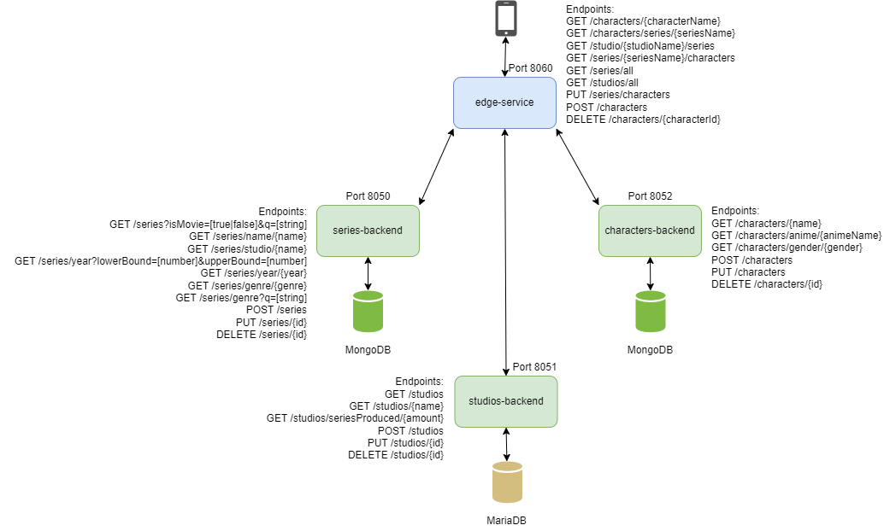
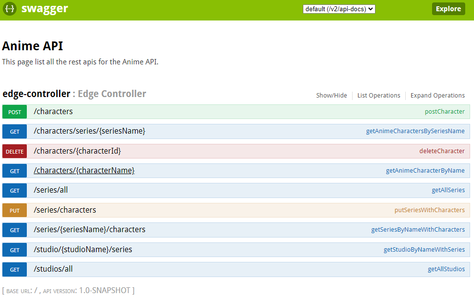

# Edge service anime
Wij hebben gekozen voor anime omdat dat een onderwerp is dat ons interesseert.
## Microservices architecture

### Microservices github links
- https://github.com/Victonator/geavanceerde-programmeer-onderwerpen-studios-backend
- https://github.com/Victonator/geavanceerde-programmeer-onderwerpen-characters-backend
- https://github.com/Victonator/geavanceerde-programmeer-onderwerpen-series-backend

### Microservices links
- Frontend xxx
- Swagger https://edge-service-server-victonator.cloud.okteto.net/swagger-ui.html
- Edge https://edge-service-server-victonator.cloud.okteto.net/
- Studios https://studio-service-server-victonator.cloud.okteto.net/
- Series https://series-service-server-victonator.cloud.okteto.net/
- Characters https://character-service-server-victonator.cloud.okteto.net/

## SwaggerUI output

